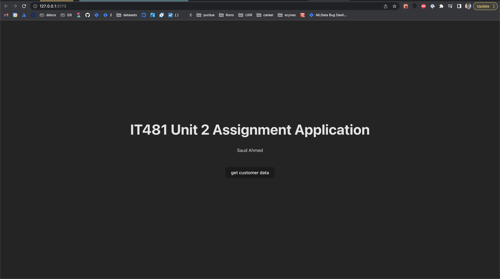
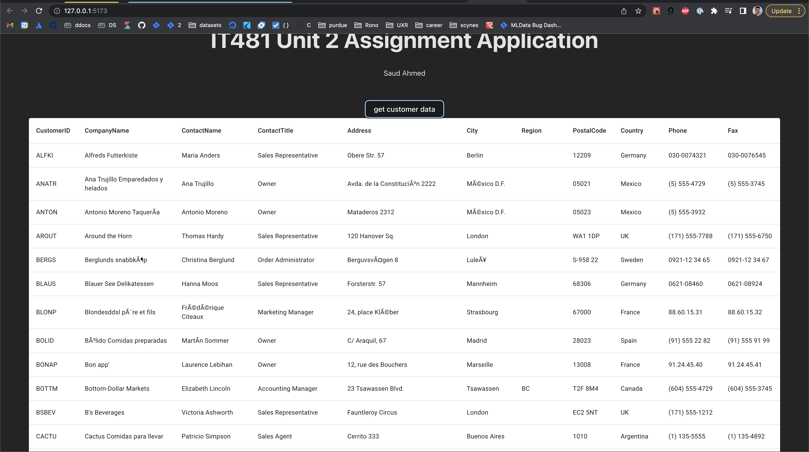

# it481
This is the application built for assignments for IT481 Advanced Software Development for Purdue University Global

The Application is built on the [Northwind database](https://github.com/Microsoft/sql-server-samples/tree/master/samples/databases/northwind-pubs) and assumes that you have it running.

#### Run the server

Note that the `SERVER`, `USERNAME`, and `PASSWORD` are read from environment variables. Create a `.env` file in the root of the project and enter your values. It should look something like this:

```
# .env file example
SERVER="localhost"
USERNAME="sa"
PASSWORD="reallyStrongPwd123"
```

```bash
npm i;
npm start
```

The output should look like this for example

```shell
~/repos/it481 > npm start

> it481@1.0.0 start
> node server.js

Example app listening on port 3005
```

You can then run this command to verify the server is running

`~/repos/it481 > curl -s -L 'localhost:3005/'`

Output:
```
Hello World!
```

#### Client 
```
cd ui;
npm i;
npm run dev
```




